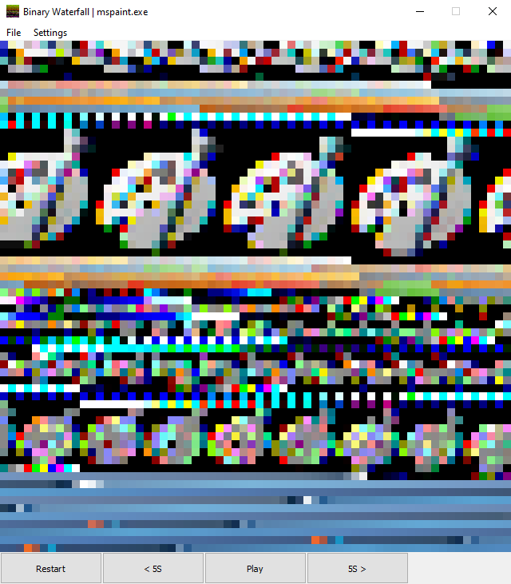

<div align="center">
	<br>
	<br>
  <p></p>
  <p><b>Binary Waterfall</b></p>
  A Raw Data Media Player
	<br>
    <a href="https://pypi.org/project/binary-waterfall/"></a>
    <a href="https://pypi.org/project/binary-waterfall/"></a>
    <br>
    <a href="https://github.com/nimaid/binary-waterfall/actions/workflows/master.yml"></a>
    <a href="https://codecov.io/gh/nimaid/binary-waterfall"></a>
    Codacy Badge
    <br>
    <a href="https://github.com/nimaid/binary-waterfall/raw/main/LICENSE"></a>
    <a href="https://pypi.org/project/binary-waterfall/"></a>
    <a href="https://paypal.me/EllaJameson"></a>
</div>

<p align="center"><a href="https://www.youtube.com/watch?v=NFe0aGO9-TE">Inspired by this video.</a></p>

<p align="center"></p>

## Downloads
<table align="center" border="0" cellspacing="0" cellpadding="0" style="border-collapse:collapse !important;">
    <tr style="border: none !important;">
        <td align="center" style="border: none !important;">
            <a href="https://github.com/nimaid/binary-waterfall/releases/latest/download/binary-waterfall.exe">
                
                <br />
                <b>Windows</b>
            </a>
        </td>
        <td align="center" style="border: none !important;">
            <a href="https://pypi.org/project/binary-waterfall/">
                
                <br />
                <b>All Platforms</b>
            </a>
        </td>
    </tr>
</table>

## Attribution
If you use this program to make a video or other project, you must provide attribution. Attribution is required regardless of whether your project is for-profit or not. Please reproduce the following attribution statement in full in your video description or otherwise include it in the references for your project:
```
Made with the help of Binary Waterfall:
https://github.com/nimaid/binary-waterfall
```

## Keyboard Shortcuts
- **Play / Pause:** `Spacebar`
- **Back:** `Left Arrow`
- **Forward:** `Right Arrow`
- **Frame Back:** `<` (`,`)
- **Frame Forward:** `>` (`.`)
- **Restart:** `R`
- **Volume Up:** `Up Arrow`
- **Volume Down:** `Down Arrow`
- **Mute / Unmute:** `M`

## Licensing Info
All features of this program are free, with one exception:

When using the pre-built `.exe` file from [the releases page](https://github.com/nimaid/binary-waterfall/releases), a watermark will be added to exported videos. This watermark is ONLY added when exporting video directly, and it will not be present on exported image stills or image sequences.

To use the `.exe` version of the program to export videos without a watermark, you need to buy a serial key for $5 USD. This serial key can be used to register infinite copies of the program, on an infinite number of computers, with no expiration date. You can activate the program by going to `Help > Registration... > Register...` and entering your serial key.

[Buy a serial key here!](https://www.patreon.com/nimaid/shop/binary-waterfall-pro-serial-key-license-69386)

If you run the `.py` file directly, you will be able to export videos without a watermark, even if the program is unregistered. You can still register the software with a valid serial key when running the `.py` version, but it will have no effect as all features will already be unlocked.

## Showcase Video
[](https://www.youtube.com/watch?v=gZRWbv_aob0 "Microsoft Paint Remix")