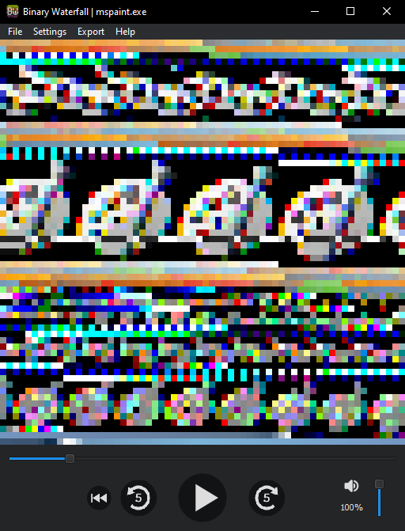

#  Binary Waterfall
### A Raw Data Media Player

<p align="center"></p>

<p align="center"><a href="https://www.youtube.com/watch?v=NFe0aGO9-TE">Inspired by this video.</a></p>

## Attribution
If you use this program to make a video or other project, you must provide attribution. Attribution is required regardless of whether your project is for-profit or not. Please reproduce the following attribution statement in full in your video description or otherwise include it in the references for your project:
```
Made with the help of Binary Waterfall:
https://github.com/nimaid/binary-waterfall
```

## Keyboard Shortcuts
- **Play / Pause:** `Spacebar`
- **Back:** `Left Arrow`
- **Forward:** `Right Arrow`
- **Frame Back:** `<` (`,`)
- **Frame Forward:** `>` (`.`)
- **Restart:** `R`
- **Volume Up:** `Up Arrow`
- **Volume Down:** `Down Arrow`
- **Mute / Unmute:** `M`

## Showcase Video
[](https://www.youtube.com/watch?v=gZRWbv_aob0 "Microsoft Paint Remix")